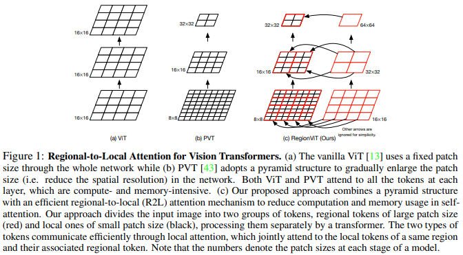
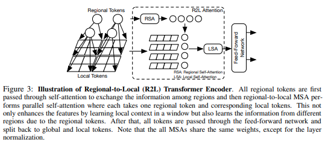

## RegionViT

</img>

</img>

"Vision transformer (ViT) has recently shown its strong capability in achieving comparable results to convolutional neural networks (CNNs) on image classification. However, vanilla ViT simply inherits the same architecture from the natural language processing directly, which is often not optimized for vision applications. Motivated by this, in this paper, we propose a new architecture that adopts the pyramid structure and employ a novel regional-to-local attention rather than global self-attention in vision transformers. More specifically, our model first generates regional tokens and local tokens from an image with different patch sizes, where each regional token is associated with a set of local tokens based on the spatial location. The regional-to-local attention includes two steps: first, the regional self-attention extract global information among all regional tokens and then the local self-attention exchanges the information among one regional token and the associated local tokens via self-attention. Therefore, even though local self-attention confines the scope in a local region but it can still receive global information. Extensive experiments on four vision tasks, including image classification, object and keypoint detection, semantics segmentation and action recognition, show that our approach outperforms or is on par with state-of-the-art ViT variants including many concurrent works." - Chun-Fu Chen, Rameswar Panda, Quanfu Fan

### Research Paper:
- https://arxiv.org/abs/2106.02689

### Official repository:
- https://github.com/IBM/RegionViT

### Usage:
```python
import numpy

key = jax.random.PRNGKey(0)

img = jax.random.normal(key, (1, 224, 224, 3))

v = RegionViT(
    dim = (64, 128, 256, 512),      # tuple of size 4, indicating dimension at each stage
    depth = (2, 2, 8, 2),           # depth of the region to local transformer at each stage
    window_size = 7,                # window size, which should be either 7 or 14
    num_classes = 1000,             # number of output classes
    tokenize_local_3_conv = False,  # whether to use a 3 layer convolution to encode the local tokens from the image. the paper uses this for the smaller models, but uses only 1 conv (set to False) for the larger models
    use_peg = False,                # whether to use positional generating module. they used this for object detection for a boost in performance
)

init_rngs = {'params': jax.random.PRNGKey(1), 
            'dropout': jax.random.PRNGKey(2)}

params = v.init(init_rngs, img)
output = v.apply(params, img, rngs=init_rngs)
print(output.shape)

n_params_flax = sum(
    jax.tree_leaves(jax.tree_map(lambda x: numpy.prod(x.shape), params))
)
print(f"Number of parameters in Flax model: {n_params_flax}")
```

## Citation:
```bibtex
@misc{https://doi.org/10.48550/arxiv.2106.02689,
  doi = {10.48550/ARXIV.2106.02689},
  
  url = {https://arxiv.org/abs/2106.02689},
  
  author = {Chen, Chun-Fu and Panda, Rameswar and Fan, Quanfu},
  
  keywords = {Computer Vision and Pattern Recognition (cs.CV), FOS: Computer and information sciences, FOS: Computer and information sciences},
  
  title = {RegionViT: Regional-to-Local Attention for Vision Transformers},
  
  publisher = {arXiv},
  
  year = {2021},
  
  copyright = {arXiv.org perpetual, non-exclusive license}
}
```